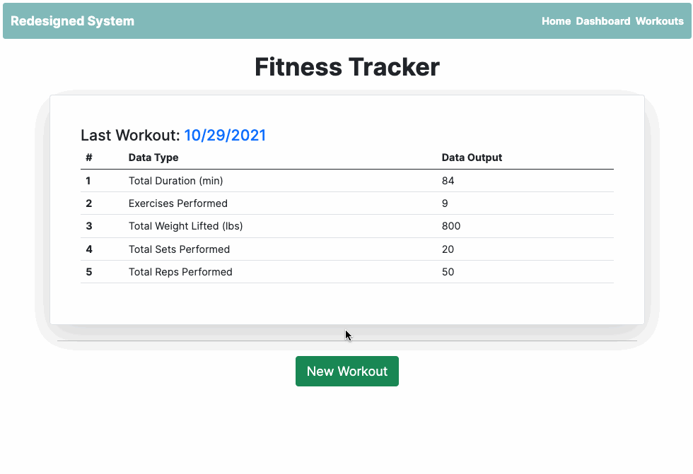

# redesigned-system

## Assignment: Workout Tracker

## Table of Contents:

1. [Description](#description)
1. [Technologies](#technologies)
1. [Assignment Overview](#assignment-overview)
1. [Video](#video)
1. [License](#license)
1. [Questions](#questions)

## Description

Redesigned System is a workout tracker app that allows the user to create, view, update, and delete daily and historical workouts.

The user is also provided with a dashboard page that summarizes the last 7 workouts in the form of two charts. The first chart is a line chart that shows the time spent working out and the second chart is a bar chart that shows the the pounds lifted.

In terms of database management, this app follows a NoSQL structure by utilizing MongoDB and Mongoose.

To view the final app deployed on Heroku, please click on the following [link](https://rocky-stream-91121.herokuapp.com/).

## Technologies

1. [Node.js](https://www.npmjs.com/package/inquirer) Packages

   a. [chart.js](https://www.npmjs.com/package/chart.js?activeTab=readme)

   b. [compression](https://www.npmjs.com/package/compression)

   c. [dotenv](https://www.npmjs.com/package/dotenv)

   d. [express](https://www.npmjs.com/package/express)

   e. [express-handlebars](https://www.npmjs.com/package/express-handlebars)

   f. [express-session](https://www.npmjs.com/package/express-session)

   g. [mongodb](https://www.npmjs.com/package/mongodb)

   g. [mongoose](https://www.npmjs.com/package/mongoose)

2. CSS Framework

   a. [Bootstrap](https://getbootstrap.com/docs/5.1/getting-started/introduction/)

3. Deployment

   a. [Heroku](https://devcenter.heroku.com/)

## Assignment Overview

For this assignment, we were provided a with starter code that had a template front end source code ready made. It was our task to create a Mongo database with a Mongoose schema and handle routes with Express.

Even though a starter code was provided, I wanted to take this opportunity to see how far I can take this assignment both on the front and back end. See summary below.

## User Story

As a user, I want to be able to:

- View, create and track daily workouts.

- Log multiple exercises in a workout on a given day.

- Track the name, type, weight, sets, reps, and duration of exercise.

As a user, If the exercise is a cardio exercise, I should be able to:

- Track my distance traveled.

## Acceptance Criteria

The user should be able to:

- Add exercises to the most recent workout plan.

- Add new exercises to a new workout plan.

- View the combined weight of multiple exercises from the past seven workouts on the `stats` page.

- View the total duration of each workout from the past seven workouts on the `stats` page.

## Updates Made To Initial Source Code

- Updating charts to show 7 day workout history based on users chosen date.

- View all historical workouts and provide the ability to:
  - Add a new exercise
  - Update an existing exercise
  - Delete an exercise
  - Delete the entire workout

## Video

## License

<a href="https://choosealicense.com/licenses/mit" target="_blank">MIT License</a>

## Questions

Github Portfolio Link: [Mehdi Mehrabani](https://github.com/mmehr1988) 
